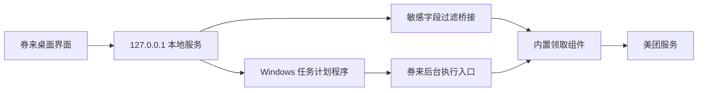

<div align="center">

# 券来

**每天准时，优惠券自己来。**

优惠券会过期，懒惰不会。让券来每天替你跑一趟。

[](https://github.com/universe-1234/quanlai/releases/latest)
[](https://github.com/universe-1234/quanlai/releases/latest)
[](./LICENSE)
[](#隐私与安全)

[下载 Windows 安装版](https://github.com/universe-1234/quanlai/releases/latest)

</div>


> [!IMPORTANT]
> 券来不是美团官方产品。登录和领券能力由公开发布的「美团红包助手 Skill」提供。使用前请阅读[服务使用规则](https://open-pepper.meituan.com/eds/rules/meituan-coupon-skill-service-rule.html)，只操作自己的账号。省钱可以积极，账号不要借来借去。

## 两分钟上手

准备一台 64 位 Windows 10/11 电脑，然后：

1. 打开 [Releases](https://github.com/universe-1234/quanlai/releases/latest)；
2. 下载 `QuanLai-Setup-版本号-x64.exe`；
3. 双击安装，打开券来。

安装包已经带齐运行所需组件，不用配置开发环境，也不用先去学一门编程语言。会双击，就已经完成了一半。

当前安装包尚未购买代码签名证书，Windows 首次运行时可能显示 SmartScreen 提示。请先确认下载地址来自本仓库的 Release，再选择“更多信息 → 仍要运行”。每个版本还会附带 `.sha256` 文件，方便认真到连一位数字都不肯放过的朋友校验文件。

## 手机号、验证码、闹钟

券来的设置流程只有三步：

1. 输入自己的手机号，阅读并同意服务规则，获取短信验证码；
2. 填写 6 位验证码，完成登录；
3. 选择每天执行时间，点击“开启自动领取”。

完成后，Windows 会创建名为 `QuanLai Daily Coupon` 的计划任务。应用窗口可以关掉，到点时电脑会在后台执行一次领取——它不需要喝咖啡，但电脑需要开机和联网。

## 它能做什么

- 使用手机号和短信验证码登录；
- 自定义每天自动执行时间；
- 关闭窗口后仍可由 Windows 计划任务执行；
- 重复运行由服务端幂等保护，不会把同一天的券领成俄罗斯套娃；
- 展示券名、面额、使用门槛和有效期；
- 所有设置与凭证留在本机，不提供远程账号托管；
- 支持桌面和窄屏窗口，窗口变小，功能不缩水。

## 它是怎么工作的



安装版把界面、本地服务、运行环境和领取组件一起放在用户电脑上。券来只监听 `127.0.0.1`，不会突然拿起大喇叭向整个局域网广播。

认证凭证和领取记录保存在本机。桥接层会过滤 `user_token`、`device_token` 等敏感字段，不把这些内容返回给页面。

## 隐私与安全

| 数据 | 如何处理 |
| --- | --- |
| 手机号 | 只在登录时交给本机领取组件，页面展示脱敏号码 |
| 短信验证码 | 只用于本次验证，不写入券来的设置文件 |
| 登录凭证 | 缓存在当前 Windows 用户的数据目录 |
| 执行计划 | 本地保存执行时间、启用状态和最后执行日期 |
| 本地服务 | 只监听 `127.0.0.1`，不向局域网或公网开放 |
| GitHub 仓库 | 不包含手机号、验证码、登录令牌或个人缓存 |

默认用户数据位置：

```text
%APPDATA%\券来
```

不要把该目录、日志或登录凭证发给别人。若要彻底清除本地状态，请先在券来中关闭自动领取并卸载应用，再手动删除上述目录。

## 常见问题

### 获取验证码后出现安全验证链接

这是服务端的正常安全校验。打开券来提供的链接完成验证，再返回应用重新获取验证码。券来不会绕过安全验证，也不会和平台风控玩躲猫猫。

### 到点了，为什么没有自动领取

先确认电脑当时处于开机、联网状态，再到 Windows“任务计划程序”中检查 `QuanLai Daily Coupon`。电脑睡着时，券来也只能跟着睡；关机期间错过的执行不会远程补跑。

### 如何关闭自动领取

打开券来，在设置页关闭自动领取即可删除计划任务。直接卸载新版安装包时，卸载程序也会移除该任务，不留一位每天准时上班却找不到公司的“幽灵员工”。

### 如何校验安装包

在安装包和 `.sha256` 文件所在目录打开 PowerShell：

```powershell
Get-FileHash -Algorithm SHA256 '.\QuanLai-Setup-1.0.5-x64.exe'
```

输出值应与 Release 中 `.sha256` 文件第一列一致。大小写不重要，数字和字母一个都不能少。

## 开发者指南

想看看它肚子里装了什么？源码开发需要 Node.js 22 或更高版本：

```bash
git clone https://github.com/universe-1234/quanlai.git
cd quanlai
npm ci
npm test
npm run desktop
```

常用命令：

```bash
npm run desktop          # 构建并启动桌面开发版
npm test                 # 运行自动测试
npm run pack:win         # 生成免安装目录
npm run dist:win         # 生成 Windows 安装程序
npm run runtime:prepare  # 准备内置运行环境与领取组件
```

项目结构：

```text
券来/
├─ src/                       # React 页面与交互
├─ electron/main.mjs          # 桌面应用入口
├─ server/                    # 本地 API、桥接与调度
├─ scripts/                   # 自动领取、运行时和图标构建脚本
├─ build/                     # 安装器配置与图标源文件
├─ tests/                     # Node 自动测试
└─ .github/workflows/         # GitHub Release 自动构建
```

发布新版本：

```bash
git tag v1.0.5
git push origin v1.0.5
```

推送 `v*` 标签后，GitHub Actions 会在 Windows 环境运行测试、构建安装包、生成 SHA-256 校验文件并发布 Release。网络偶尔闹脾气也没关系，创建 Release 和上传文件都带有自动重试。

## 已完成验证

当前版本已在 Windows 环境完成：

- 6 项自动测试全部通过；
- 生产页面构建通过；
- 真实短信发送与验证码登录通过；
- 首次真实领取成功返回 7 张券；
- Windows 计划任务创建并手动触发成功；
- 内置运行环境与领取组件在全新隔离目录中可用；
- 免安装版与安装版均通过独立启动测试；
- 安装、运行、卸载完整链路通过；
- GitHub 云端构建与 Release 发布通过；
- 仓库扫描未发现手机号、验证码或登录令牌。

设计与交互验收详见 [`design-qa.md`](./design-qa.md)。测试不是为了让徽章更好看，是为了不让你在凌晨零点替程序加班。

## 使用边界

- 仅用于本人账号和正常个人用途；
- 遵守美团及相关服务规则；
- 不保证优惠券种类、数量、有效期或长期可用性；
- 平台规则、领取组件版本或网络环境变化都可能影响运行；
- 不提供绕过验证码、安全校验、访问控制或反滥用机制的功能；
- 本项目按 MIT 许可证发布，第三方组件许可见 [`THIRD_PARTY_NOTICES.md`](./THIRD_PARTY_NOTICES.md)。

发现问题欢迎提交 Issue。程序可以有 bug，别让 bug 过上包吃包住的日子。
