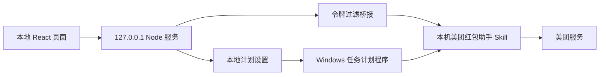

<div align="center">

# 券来

**每天准时，优惠券自己来。**

一个简洁、开源、本地优先的美团优惠券自动领取界面。


</div>


> [!IMPORTANT]
> 券来是独立的本地界面和调度工具，不是美团官方产品，也不分发、复制或逆向美团接口。真实登录和领券由用户电脑中已安装的「美团红包助手 Skill」完成。使用前请阅读[《美团红包助手 Skill 服务使用规则》](https://open-pepper.meituan.com/eds/rules/meituan-coupon-skill-service-rule.html)。

## 它能做什么

- 手机号 + 短信验证码登录；
- 自定义每天执行时间；
- Windows 自动创建系统计划任务，关闭券来页面后仍可按时运行；
- 调用本机已安装的官方 Skill 领取当日权益包；
- 服务端幂等，重复运行不会重复发放同一天的券；
- 本地桥接会过滤令牌字段，不在本仓库的数据目录中持久化或上传登录令牌；
- 响应式界面，支持桌面与手机宽度。

## 运行前提

请先准备：

1. Windows 10/11（完整的后台计划任务体验）；
2. [Node.js](https://nodejs.org/) 22 或更高版本；
3. WorkBuddy 及已获准使用的「美团红包助手 Skill」；
4. 默认安装目录中应存在：

   ```text
   ~/.workbuddy/skills/meituan-coupon__skillhub
   ```

券来不会把官方 Skill 源码、接口地址、渠道标识或用户令牌打包进仓库。没有该 Skill 时，页面会显示“官方 Skill 未连接”，真实短信与领券功能不可用。

## 快速开始

### Windows：双击启动

下载并解压项目后，双击：

```text
启动券来.bat
```

首次运行会自动安装依赖并构建页面，随后打开 `http://127.0.0.1:4173`。

在页面中：

1. 输入手机号；
2. 阅读并勾选官方服务使用规则；
3. 获取并填写 6 位短信验证码；
4. 选择每天执行时间；
5. 点击“开启自动领取”。

Windows 会创建名为 `QuanLai Daily Coupon` 的计划任务。到点后，即使网页和终端已经关闭，系统也会运行一次本地领券脚本。

### 使用命令行启动

```bash
npm install
npm run build
npm start
```

打开 [http://127.0.0.1:4173](http://127.0.0.1:4173)。服务仅监听本机回环地址，不对局域网公开。

### macOS / Linux

页面与本地服务可以正常运行：

```bash
npm install
npm run build
npm start
```

非 Windows 系统目前使用进程内调度，必须保持 `npm start` 运行。若希望关闭页面后继续执行，可自行用系统 `cron` 调用：

```cron
0 0 * * * cd /absolute/path/to/quanlai && /usr/bin/node scripts/issue.mjs --auto
```

请按实际 Node 路径和执行时间调整该示例。

## 工作原理



券来本身负责三件事：

- 提供手机号验证和执行时间设置界面；
- 以子进程方式调用本机官方 Skill，并过滤响应中的敏感字段；
- 保存不含手机号和令牌的执行时间，在 Windows 上注册每日计划任务。

认证凭证、设备标识和领券历史仍由官方 Skill 自己的本地缓存机制管理。

## 隐私与安全

| 项目 | 处理方式 |
| --- | --- |
| 本地服务 | 只监听 `127.0.0.1` |
| 手机号 | 仅在用户发起登录时传给本机官方 Skill；界面返回值使用脱敏号码 |
| 短信验证码 | 仅用于本次官方登录验证，不写入券来的 JSON 文件 |
| 登录令牌 | 由官方 Skill 管理；桥接层过滤 `user_token`、`device_token` 等字段 |
| 券来本地数据 | 默认只保存执行时间和最后运行日期 |
| Git 仓库 | `.env`、`node_modules`、构建产物和 QA 临时截图均被忽略 |

默认计划数据位置：

```text
Windows: %APPDATA%\券来\schedule.json
macOS/Linux: ~/.config/quanlai/schedule.json
```

> [!CAUTION]
> `npm run issue:auto` 会发起真实领券请求。请只在自己的账号上使用，不要批量操作、转发凭证或绕过平台风控。

## 可用命令

```bash
npm run build       # 构建生产页面
npm start           # 启动本地页面、API 与进程内调度器
npm test            # 运行自动测试
npm run issue:auto  # 立即执行一次真实领券（具有外部效果）
npm run dev         # 启动 Vite 开发页面，需同时运行 npm start
```

本地开发时可使用两个终端：

```bash
# 终端 1：本地 API
npm start

# 终端 2：热更新页面
npm run dev
```

开发页面地址为 `http://127.0.0.1:5173`，`/api` 会代理到本地服务。

## 可选配置

复制 `.env.example` 为 `.env`，仅在默认路径不适用时修改：

```dotenv
QUANLAI_PORT=4173
WORKBUDDY_MEITUAN_SKILL_ROOT=C:\path\to\meituan-coupon__skillhub
WORKBUDDY_PYTHON=C:\path\to\python.exe
```

不要在 `.env` 中保存手机号、验证码或登录令牌。

## 常见问题

### 页面显示“官方 Skill 未连接”

确认 Skill 目录和 Python 环境存在；若安装位置不同，请在 `.env` 中设置上面的两个路径。

### 获取验证码后出现安全验证链接

这是官方服务的安全校验。打开页面提供的链接完成验证，再回到券来重新获取验证码；不要尝试绕过。

### 如何检查 Windows 计划任务

```powershell
Get-ScheduledTask -TaskName 'QuanLai Daily Coupon'
Get-ScheduledTaskInfo -TaskName 'QuanLai Daily Coupon'
```

正常状态应为 `Ready`，且 `LastTaskResult` 为 `0`。

### 如何移除 Windows 计划任务

```powershell
Unregister-ScheduledTask -TaskName 'QuanLai Daily Coupon' -Confirm:$false
```

该命令只移除券来的系统计划任务，不会删除官方 Skill 的登录状态或领券记录。

## 项目结构

```text
券来/
├─ src/                    # React 页面与交互
├─ server/
│  ├─ index.mjs            # 本地 HTTP 服务
│  ├─ workbuddy-skill.mjs  # 官方 Skill 桥接与敏感字段过滤
│  ├─ scheduler.mjs        # 进程内每日调度
│  └─ system-schedule.mjs  # Windows 计划任务注册
├─ scripts/
│  └─ issue.mjs            # 无人值守领券入口
├─ tests/                  # Node 自动测试
├─ 启动券来.bat            # Windows 一键启动
└─ design-qa.md            # 设计与交互验收记录
```

## 已完成验证

当前版本已在 Windows 环境完成：

- 生产构建通过；
- 6 项自动测试全部通过；
- 375px 手机端无横向溢出；
- 真实短信发送与验证码登录通过；
- 首次真实领券成功返回 7 张券；
- Windows 计划任务创建成功，手动触发退出码为 `0`；
- 仓库扫描未发现测试手机号、短信验证码、接口渠道标识或登录令牌。

详见 [`design-qa.md`](./design-qa.md)。

## 使用边界

- 仅用于本人账号和正常个人用途；
- 遵守美团及官方 Skill 的服务规则；
- 不保证优惠券种类、数量、有效期或长期可用性；
- 平台规则、Skill 版本或网络环境变化都可能影响运行；
- 本项目不提供绕过验证码、安全校验、访问控制或反滥用机制的功能。

## 开源发布前

仓库目前未附带开源许可证。发布到 GitHub 前，请根据你的开放范围选择并添加许可证（例如 MIT、Apache-2.0 或保留全部权利），同时确认官方 Skill 的使用与分发边界。

如果这个项目对你有帮助，欢迎提交 Issue 或 Pull Request，让本地自动化更简单、更透明。
