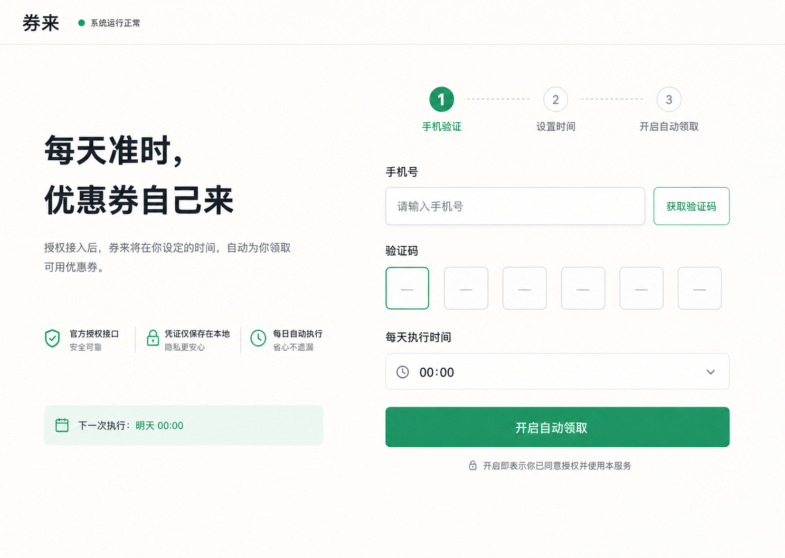
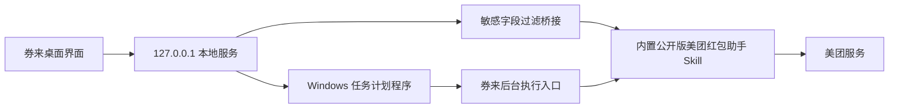

<div align="center">

# 券来

**每天准时，优惠券自己来。**

一个简洁、开源、本地优先的美团优惠券自动领取工具。

[](https://github.com/universe-1234/quanlai/releases/latest)
[](https://github.com/universe-1234/quanlai/releases/latest)
[](./LICENSE)
[](#隐私与安全)

[下载 Windows 安装版](https://github.com/universe-1234/quanlai/releases/latest)

</div>



> [!IMPORTANT]
> 券来不是美团官方产品。登录和领券能力来自公开发布的「美团红包助手 Skill」，使用前请阅读[服务使用规则](https://open-pepper.meituan.com/eds/rules/meituan-coupon-skill-service-rule.html)。请只操作本人账号，并遵守平台规则。

## 下载即用

普通用户只需要一台 64 位 Windows 10/11 电脑：

1. 打开 [Releases](https://github.com/universe-1234/quanlai/releases/latest)；
2. 下载 `券来-Setup-版本号-x64.exe`；
3. 双击安装并启动券来。

安装包已经包含桌面运行环境、独立 Python 和公开发布的 Skill，**不需要安装 WorkBuddy、Node.js 或 Python**。

当前安装包未购买代码签名证书。Windows 首次运行时可能显示 SmartScreen 提示，请核对下载地址确实是本仓库的 Release，再选择“更多信息 → 仍要运行”。Release 同时提供 `.sha256` 文件，可用于校验下载完整性。

## 三步完成设置

1. 输入自己的手机号，阅读并同意服务规则，然后获取短信验证码；
2. 填写 6 位验证码完成登录；
3. 选择每天执行时间，点击“开启自动领取”。

券来会创建名为 `QuanLai Daily Coupon` 的 Windows 计划任务。设置完成后可以关闭应用；到点时，只要电脑处于开机且联网状态，系统就会在后台执行一次领取。

## 功能特点

- 手机号 + 短信验证码登录；
- 自定义每天自动执行时间；
- 关闭窗口后仍可由 Windows 计划任务执行；
- 重复运行由服务端幂等保护，不会重复发放同一天权益；
- 领取结果直接展示券名、面额、门槛与有效期；
- 本地优先，不提供远程账号托管服务；
- 桌面和窄屏窗口均可舒适使用。

## 工作原理



安装版把界面、本地服务、Python 运行时与 Skill 一起放在用户电脑上。券来只监听 `127.0.0.1`，不会把本地接口开放到局域网。

认证凭证和领券记录由 Skill 保存在本机；券来的桥接层会过滤 `user_token`、`device_token` 等敏感字段，不把这些值返回给页面。

## 隐私与安全

| 数据 | 处理方式 |
| --- | --- |
| 手机号 | 仅在登录时传给本机 Skill；页面展示脱敏号码 |
| 短信验证码 | 仅用于本次验证，不写入券来的设置文件 |
| 登录凭证 | 由内置 Skill 缓存在当前 Windows 用户的数据目录 |
| 执行计划 | 本地保存执行时间、启用状态和最后执行日期 |
| 网络服务 | 只监听 `127.0.0.1`，不对局域网或公网开放 |
| GitHub 仓库 | 不包含用户手机号、验证码、登录令牌或本地缓存 |

默认用户数据位置：

```text
%APPDATA%\券来
```

不要把该目录、日志或登录凭证发给他人。若需要彻底清除本地状态，先在券来中关闭自动领取并卸载应用，再手动删除上述目录。

## 常见问题

### 获取验证码后出现安全验证链接

这是服务端的正常安全校验。打开券来提供的链接完成验证，再返回应用重新获取验证码；本项目不会绕过安全验证或平台风控。

### 到点后没有自动领取

请确认电脑当时处于开机、联网状态，并在 Windows“任务计划程序”中检查 `QuanLai Daily Coupon`。睡眠或关机期间错过的执行不会由券来远程补跑。

### 如何关闭自动领取

打开券来，在设置页关闭自动领取即可删除计划任务。直接卸载新版安装包时，卸载程序也会移除该计划任务。

### 如何校验安装包

在安装包和 `.sha256` 文件所在目录打开 PowerShell：

```powershell
Get-FileHash -Algorithm SHA256 '.\券来-Setup-1.0.4-x64.exe'
```

输出值应与 Release 中 `.sha256` 文件的第一列一致。

### 安装后还需要 WorkBuddy 吗

不需要。Windows 安装包已经携带运行所需组件。WorkBuddy 只与早期源码运行方式有关，不是普通用户的安装前提。

## 开发者指南

源码开发需要 Node.js 22 或更高版本：

```bash
git clone https://github.com/universe-1234/quanlai.git
cd quanlai
npm ci
npm test
npm run desktop
```

常用命令：

```bash
npm run desktop          # 构建并启动桌面开发版
npm test                 # 运行自动测试
npm run pack:win         # 生成免安装目录
npm run dist:win         # 生成 Windows 安装程序
npm run runtime:prepare  # 准备内置 Python 与公开 Skill
```

项目结构：

```text
券来/
├─ src/                       # React 页面与交互
├─ electron/main.mjs          # 桌面应用入口
├─ server/                    # 本地 API、桥接与调度
├─ scripts/                   # 自动领取、运行时和图标构建脚本
├─ build/                     # 安装器配置与图标源文件
├─ tests/                     # Node 自动测试
└─ .github/workflows/         # GitHub Release 自动构建
```

发布新版本：

```bash
git tag v1.0.4
git push origin v1.0.4
```

推送 `v*` 标签后，GitHub Actions 会在 Windows 环境执行测试、构建安装包、生成 SHA-256 校验文件并发布 Release。工作流使用 GitHub 官方的 `checkout`、`setup-node` 与 GitHub CLI。

## 已完成验证

当前版本已在 Windows 环境完成：

- 6 项自动测试全部通过；
- 生产页面构建通过；
- 真实短信发送与验证码登录通过；
- 首次真实领取成功返回 7 张券；
- Windows 计划任务创建并手动触发成功；
- 内置 Python + 公开 Skill 在不安装 WorkBuddy 的隔离目录中可用；
- 免安装版与安装版均通过独立启动测试；
- 安装、运行、卸载完整链路通过；
- 仓库扫描未发现手机号、验证码或登录令牌。

设计与交互验收详见 [`design-qa.md`](./design-qa.md)。

## 使用边界

- 仅用于本人账号和正常个人用途；
- 遵守美团及 Skill 的服务规则；
- 不保证优惠券种类、数量、有效期或长期可用性；
- 平台规则、Skill 版本或网络环境变化都可能影响运行；
- 不提供绕过验证码、安全校验、访问控制或反滥用机制的功能；
- 本项目按 MIT 许可证发布，第三方组件许可见 [`THIRD_PARTY_NOTICES.md`](./THIRD_PARTY_NOTICES.md)。

欢迎提交 Issue 或 Pull Request。
