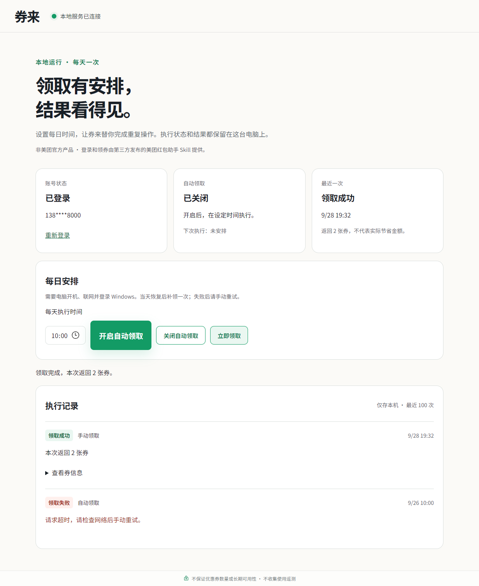

# 券来

在 Windows 本机为自己的美团账号安排每日领券，并查看每次执行的实际结果。

**非美团官方产品。** 登录和领取依赖公开发布的「美团红包助手 Skill」，不保证活动、券数量或接口长期可用。使用前请阅读[上游服务规则](https://open-pepper.meituan.com/eds/rules/meituan-coupon-skill-service-rule.html)。本项目不提供账号托管。



> 截图来自实际运行的界面，但账号、领取结果和券信息由测试模拟，不能作为真实领券证明。[窄窗口截图](docs/screenshots/narrow-mock.png)同样使用模拟数据。

## 安装与使用

本分支是 **1.0.6-rc.1 候选版**，尚未正式发布。PR 的 Windows CI 通过后，可在对应 [Actions 运行](https://github.com/universe-1234/quanlai/actions)的 `windows-candidate` 构建产物中下载安装包（需要 GitHub 登录）。历史版本位于 [Releases](https://github.com/universe-1234/quanlai/releases)，不包含本分支的全部改进。

1. 在 Windows 10/11 x64 安装 `QuanLai-Setup-版本号-x64.exe`。安装路径可以包含空格，安装包内置 Electron、Python 和领取组件。
2. 首次运行时输入本人手机号，同意服务规则并填写短信验证码。重发倒计时只表示发送间隔，不表示验证码有效期。
3. 设置本地时间并开启自动领取。只有系统任务配置成功后，才显示“已开启”。也可以先点击“立即领取”。
4. 以后打开应用会恢复本地登录信息、执行时间、自动开关和最近记录。登录过期时重新登录。

候选包未进行可信代码签名。下载后先核对来源与校验值；若 Windows 拦截，请检查具体提示，不要关闭系统安全保护。

## 调度规则

- Windows 唯一定时来源是计划任务 `QuanLai Daily Coupon`。关闭窗口后仍可执行；需要电脑开机、联网且用户已登录 Windows。
- 使用电脑本地时区。每天在设定时间尝试一次；应用启动、用户登录或系统恢复后，如果当天已过时间且尚未自动尝试，则补领一次。不补往日，不主动唤醒电脑。
- 自动失败后当天不循环重试，可点击“手动重试”。当天手动成功后，自动入口跳过当天任务。
- 手动、命令行和后台共享执行服务及跨进程锁，同一时刻只允许一次领取。异常退出后回收死进程锁，将未完成记录标为“中断”；中断不代表上游一定未发券，重试前应确认平台结果。
- 关闭时先保存禁用状态，再移除计划任务。清理失败会明确提示，可再次点击关闭；残留任务不会发起新领取。已经开始的请求仍可能完成。
- 升级保留原数据目录、凭证、任务名称和时间；启动时核对并修复旧参数。卸载时禁用并移除任务，升级安装不关闭原有安排。
- Linux/macOS 源码运行模式仅在应用运行期间定时检查，关闭应用即停止。本项目没有提供这些平台的安装包。

## 结果与失败处理

最近 100 次执行记录保存在本机，包含来源、起止时间、成功/失败/中断状态和上游返回的券数量及券信息。缺少面额或有效期时不推算，不统计虚构的累计节省金额。

| 提示 | 处理方式 |
| --- | --- |
| 登录失效 | 重新登录后手动重试；关闭任务不需要登录 |
| 网络失败、超时 | 检查网络，确认平台结果后手动重试 |
| 组件不可用、格式异常 | 检查安装完整性或等待组件兼容修复 |
| 系统任务异常 | 点击“修复 / 确认任务”或重试关闭；失败时保留原配置 |
| 本地记录损坏 | 先关闭自动领取，保留原数据及 `.corrupt` 诊断副本再排查，不要当作首次启动清空 |

状态每 10 秒刷新，执行中约每 1.5 秒刷新；关闭页面后停止轮询。首页账号状态来自本地凭证检查，领取时由上游组件再验证有效性；它不代表登录永不过期。

## 数据与第三方边界

Windows 默认数据目录仍为 `%APPDATA%\券来`。`schedule.json` 保存设置，`runs.json` 保存记录；两者使用原子替换写入。执行/状态锁也放在该目录。首次升级没有历史会显示空状态，损坏文件会报错并保留副本。

凭证继续由第三方组件管理；本项目不把令牌、原始手机号、原始异常或本地路径返回给界面，记录仅保留允许展示的券字段。不要公开整个用户数据目录或组件缓存，它们可能包含凭证。没有遥测、云端同步或自动更新；登录和领券仍需要访问上游服务。

## 开发、测试与打包

使用 Node.js 22+：

```sh
npm ci
npm test
npm run build
npx playwright install chromium
npm run test:ui
npm run desktop
```

已有 Edge 时可在 PowerShell 设置 `$env:PW_CHANNEL='msedge'` 后运行界面测试。源码登录/领券需要本地 Skill 与 Python，可用 `QUANLAI_SKILL_ROOT`、`QUANLAI_PYTHON` 指定。`QUANLAI_DATA_DIR` 和 `QUANLAI_TASK_NAME` 用于测试隔离；显式覆盖值会传入计划任务，使后台继续使用同一配置。

Windows 使用 `npm run dist:win` 构建。ClawHub 固定版本当前可能不可用；可显式从本仓库公开的 v1.0.5 安装包恢复原运行时，再构建：

```powershell
./scripts/restore-release-runtime.ps1
npm run dist:win
```

恢复脚本需要 7-Zip 24.09+ 并校验固定 SHA-256，只提取公开安装包的运行时，不读取个人凭证。运行时仍是 Python 3.13.12、Skill 1.0.0、httpx 0.28.1，不代表上游组件已更新。临时下载目录会在脚本结束时打印。

Windows 实机测试：

```powershell
npm run test:windows
node scripts/build-qa.mjs
node scripts/test-windows-install.mjs
```

QA 使用独立应用标识、数据目录、任务名及模拟上游，并自动安装/卸载。不要用正常安装包替换 QA 输入。详见[验证记录](docs/validation.md)和[第三方说明](THIRD_PARTY_NOTICES.md)。本轮不发布正式 Release。

## 结构与接口

`React → 本地 HTTP API → 统一执行服务 → Python Skill → 上游服务`

`Windows 任务 / 命令行 → 同一执行服务 → 执行锁 + 设置 + 最近 100 条记录`

接口：`GET /api/status`、`GET /api/runs`、`POST /api/schedule`（`enabled`、`time`）、`POST /api/coupons/issue`。重复执行返回 HTTP 409；领取失败仍带运行标识与归档结果。原状态字段保持兼容，新字段提供任务实际状态、下一次执行时间和最近结果。

MIT License。第三方组件与商标的权利归各自权利人所有。
